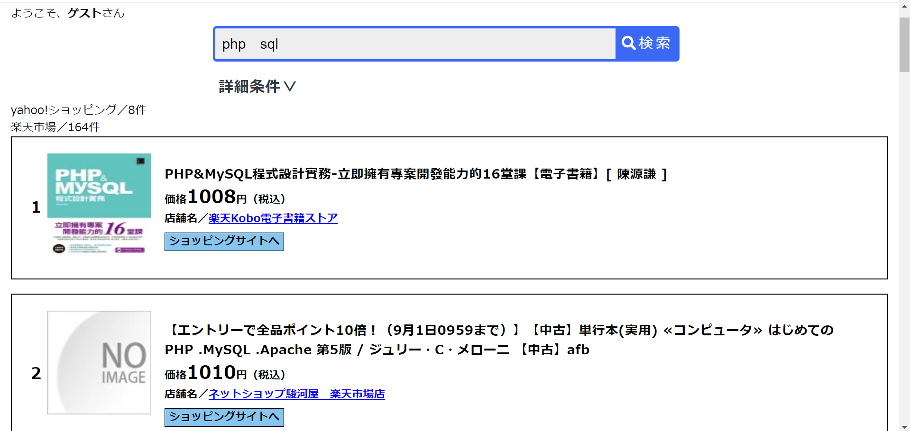

# search_price
## NAME
 最安値検索(yahoo!ショッピング&amp;楽天市場)  
 [the lowest price search (yahoo!shopping&rakuten-ichiba)]

## OVERVIEW
"最安値検索(yahoo!ショッピング&amp;楽天市場)"can arrange items you search for in order of lower price with PHP and yahoo&rakuten API.

## USAGE
1. You enter 'keywords' and select detail conditions (shops, genres and the range of prices).  
2. after you push search button, 20 products related to the keyword you searched for are displayed. they are arranged in order of lower price. If you search for more results, you press the button "次のページへ" at the bottom of the page. 

## NOTE
I don't test environments under Linux and Mac.

## AUTHOR
Asuma Miyoshi

## REFERENCES
[Yahoo!shopping_API](https://developer.yahoo.co.jp/sample/shopping/)  
[楽天市場_API](https://webservice.rakuten.co.jp/api/ichibaitemsearch/)
