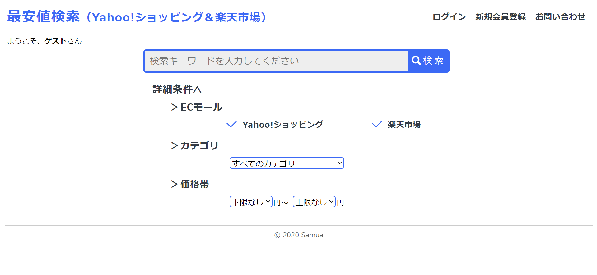

# search_price
## 名前
 最安値検索(yahoo!ショッピング&amp;楽天市場)  

## 概要
検索したキーワードに関する商品を「Yahoo!ショッピング」と「楽天市場」から同時に価格の安い順に取得します。

## USAGE
1. ヘッダーの右側にある「**新規会員登録**」ボタンを押して、新規会員登録を行ってください。（会員登録をしなくてもご利用できます）
2. 「*ユーザー名*」「*メールアドレス*」「*パスワード*」を入力して会員登録を完了させてください。
3. You press the button "ログイン" at the header of the page and login your account.If you save your email and password, you check the checkbox. 
4. You enter 'keywords' and select detail conditions (shops, categories and the range of prices) at the top page.  
5. after you push search button, 20 products related to the keyword you searched for are displayed. they are arranged in order of lower price. If you search for more results, you press the button "次のページへ" at the bottom of the page. 
6. If there are questions, you can send the contact form from "お問い合わせ" at the header of the page.

## 動作環境
Windows  
※Linux,Macではテストを行えていません

## ライセンス
MIT

## 作者
三吉 明日真

## 参照
[Yahoo!shopping_API](https://developer.yahoo.co.jp/sample/shopping/)  
[楽天市場_API](https://webservice.rakuten.co.jp/api/ichibaitemsearch/)
